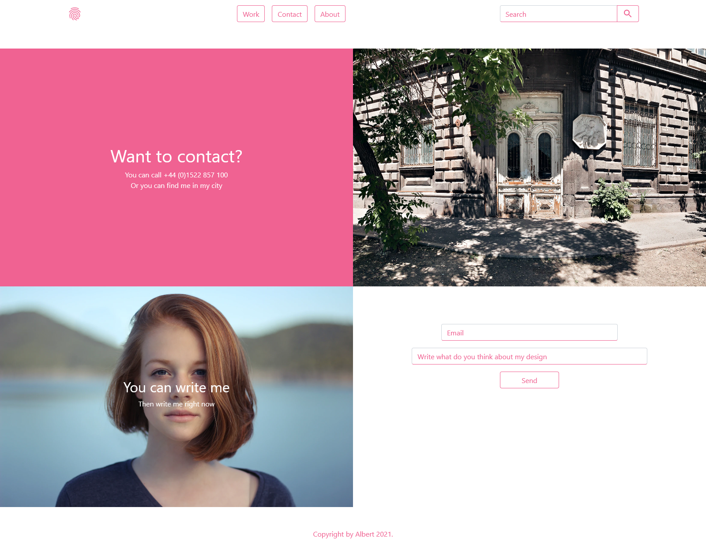

# Background images 


- Used Pixabay API
- You can find many backgrounds




## Webpack config part

````javascript
const { CleanWebpackPlugin } = require('clean-webpack-plugin');
const HtmlWebpackPlugin = require('html-webpack-plugin');
const path = require('path');
const webpack = require('webpack');
const MiniCssExtractPlugin = require('mini-css-extract-plugin');
const ImageMinimizerPlugin = require('image-minimizer-webpack-plugin');
````
